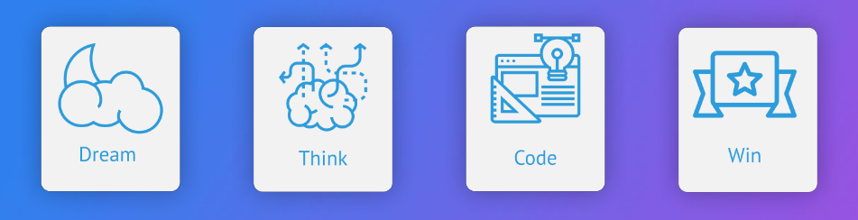

## Dream Think Code Phase

### Summary & Objective
* Terinsipirasi dari Jargon Proclub :open_mouth:
* Bakal menjadi agenda utama Proclub
* Membuat resource untuk mengikuti kompetisi

#### # Dream Phase
* Setiap anggota Proclub submit ide pada Form Dream Phase
* Melakukan self-assignment pada Ide yang tertarik
* Mungkin bisa bertanya-tanya pada peng-submit ide terkait (untuk memastikan)

#### # Think Phase
* Melakukan brainstorming di ProclubHQ (E106) - Minimal 1 Kali
* Validasi Ide
* Wireframing / Design UI
* Memilih Tech-stack yang akan diimplementasikan

####  # Code Phase
* Implementasi & Eksekusi sampai tahap produk bisa dipresentasikan.

### Schedule (2017)
- [x] Dream Phase : 3 May 2017 - 2 Juni 2017 (Deadline Submit Ide)
- [ ] Think Phase : 3 Juni 2017 3 Juni 2017
- [ ] Code Phase : 30 Agustus 2017 - 1 September 2017

*Note : Tanggal masuk kuliah sekitar 20 Agustus 2017*

### Links
* Form Dream Phase : [goo.gl/CwLcBF](goo.gl/CwLcBF)
* Result Sheet : [Shared on group](#)

### Rules
* Semua anggota Proclub **wajib submit ide** pada dream phase.
* Mohon pertanggung jawabanya pada ide yang disubmit. Apabila banyak yang tertarik (assign) mohon untuk didiskuiskan.

### F.A.Q
**Kenapa sih outputnya harus ada berupa poster**    
Buat publikasi, biar Proclub terlihat produktif oleh pihak kampus (meskipun aslinya emang produktif :+1:, tetapi kurang terlihat oleh pihak kampus)  

**Bagaimana kalau ide saya di-implementasikan oleh teman-teman yang lain tanpa sepengetahuan saya ?**    
Dalam sejarah Proclub belum pernah ada yang namanya pencurian ide. Lagipula ide itu cuman bagian kecil dari suatu produk.  
> *Ide itu cuman 20%, sisa 80%-nya eksekusi - Nanda Budi Prayuga (Proclub 2013)*

**Ini tim-nya bebas yah, tidak mempengaruhi angkatan ?**    
Ya, tim dibentuk berdasarkan ketertarikan pada suatu ide dan masalah, 
karena biasanya salah satu faktor tim yang solid itu adalah ketertarikan pada suatu ide dan masalah yang sama.    

**Saya sudah dan lagi ngerjain sesuatu sama tim saya, gimana nih ?**    
Di submit aja idenya, dan kasih keterangan 'Already Implemented' atau sejenisnya dan 'Fixed Member'
pada result sheet.
Tetapi tetap diharuskan untuk melakukan submit ide yang baru.

**Jadi boleh ngerjain 2 Ide sekaligus kalo gitu ?**    
Yup, gak masalah asal berkomitmen aja pada setiap tim ide yang dikerjain. Tetapi kalo misalkan mau fokus ama ide yang sedang dikerjain sekarang gapapa kok.

**Bagaimana kalau dalam 1 ide banyak yang assign / tertarik (misalkan sampai 10 orang) ?**    
* Tidak boleh ada pemilihan sebagian.
* Harusnya malah lebih bagus. lebih cepat dieksekusi

**Terus kalau lomba gimana nih ?, kan biasanya maksimal yang ikut cuman 3-5 orang.**    
* Biasanya semua tim tetep berangkat, (soal ongkos bisa diatur), cuman biasanya gak dapet sertifikat doang.
* Masalah Sertifikat, kadang ada beberapa lomba yang bisa ngasih lebih kok (dari pengalaman), tapi ada yang enggak juga

**Ide saya kurang cocok buat lomba nih ?? ex : Sistem Informasi Aplikasi Laundry**    
Submit aja, meskipun ide-nya gak cocok buat kompetisi, biasanya ada 1, atau 2 kompetisi yang cocok / bisa disubmit :)

**Sayang nih kalo produknya sampai Protoyping doang, takutnya malah jadi sesuatu yang kurang berguna.**    
Tujuan dari agenda ini adalah untuk membuat resource untuk mengikuti kompetisi. Mungkin apabila produknya
sudah diikutkan kompetisi dan menang, bisa menjadi pemantapan validasi ide dan bisa lanjut ke tahap Production,
siapa tau produknya dapat bermanfaat bagi orang lain :sunglasses:

**Saya adanya Project nih, boleh di post disini gak ?**    
Boleh, tapi tolong tulis requirement se-detail mungkin biar sesuai ama ekspektasi yang lain :heart:,
mulai dari fitur, teknologi yang akan dipakai, ditambah :moneybag: atau equity :+1: :sunglasses:

### Contribute
Mau menambahkan rules ? mohon diskusikan di group.
